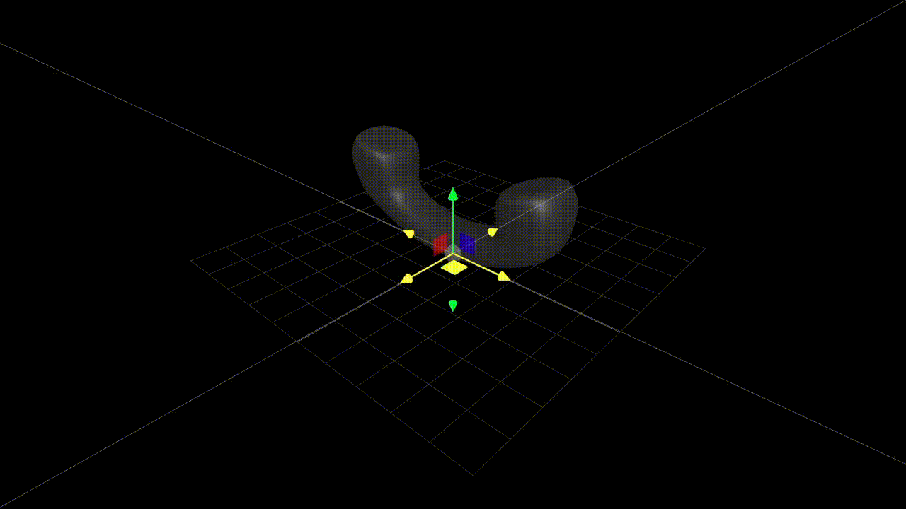

# squishy-tely

<div id="top"></div
<div align="center">



  <h3 align="center">Draggable telephone with dynamic physics based on how fast and where its being dragged. </h3>

</div>

## Installation
```
npm install

npm run dev
```

## models

- [tely](https://sketchfab.com/3d-models/telephone-receiver-3d-icon-f69ff8c7e4a84a5e807ab3069bfbf67b)